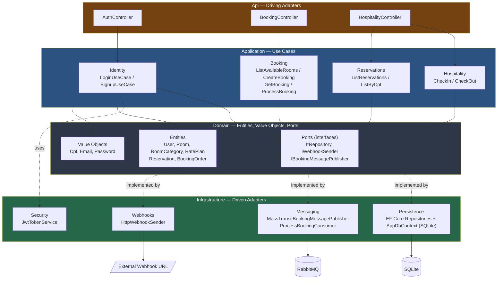
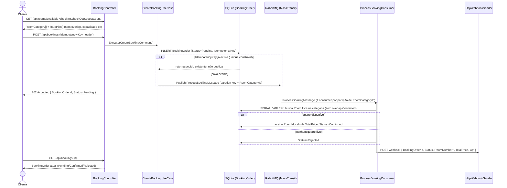
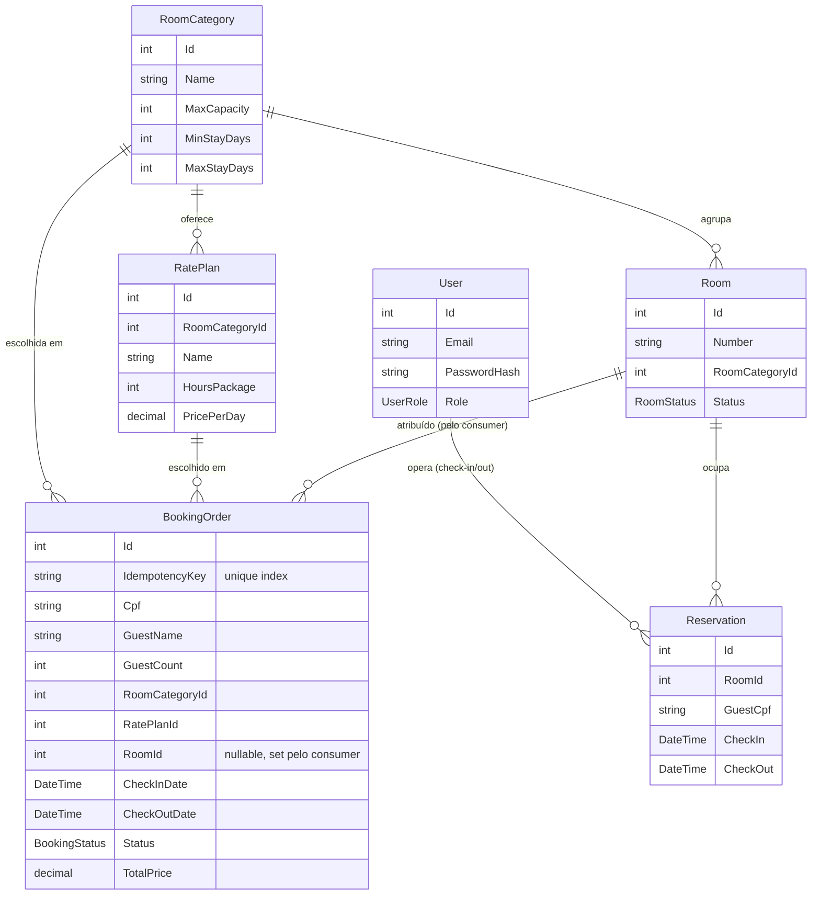

# CheckInApp

Sistema de hospedagem com dois fluxos independentes:

- **Hospitality** — check-in/check-out presencial, operado por funcionário autenticado.
- **Reserva Web** — catálogo de quartos self-service para o hóspede, com pedido assíncrono,
  idempotente e consistente sob concorrência (nunca aluga o mesmo quarto duas vezes no
  mesmo período).

Construído em .NET 8 seguindo Clean Architecture / Ports & Adapters.

## Stack

| Camada | Tecnologia |
|---|---|
| API | ASP.NET Core 8 (Web API), Swagger/OpenAPI |
| Autenticação | JWT Bearer (`Microsoft.AspNetCore.Authentication.JwtBearer`) + RBAC por Roles |
| Persistência | EF Core 8 + SQLite (`Microsoft.EntityFrameworkCore.Sqlite`) |
| Mensageria | RabbitMQ via MassTransit (`MassTransit.RabbitMQ`) |
| Senhas | BCrypt.Net-Next |
| Testes | xUnit + Moq + FluentAssertions |

## Arquitetura

Quatro camadas, dependência sempre apontando para dentro (`Domain` não conhece nada,
`Application` só conhece `Domain`, `Infrastructure`/`Api` implementam portas do `Domain`).
`Program.cs` é a **composition root única** — o único ponto do código onde todas as
camadas se conhecem.



**Por que essa forma:** cada `UseCase` implementa uma interface própria (`ICreateBookingUseCase`,
`ICheckInUseCase`, ...) e depende só de `Domain.Ports`, nunca de uma implementação
concreta de `Infrastructure`. Isso deixa toda a lógica de negócio testável com mocks
(ver `CheckInApp.Tests/`) sem precisar de banco ou fila real, e permite trocar SQLite por
outro RDBMS ou RabbitMQ por outro broker sem tocar em `Application`/`Domain`.

## Fluxo: Reserva Web (assíncrono, idempotente, concorrente)

Este é o fluxo mais complexo do sistema — cliente sem autenticação escolhe quarto,
pedido é processado fora do request HTTP, e há garantias de concorrência para nunca
dar overbooking.



## Modelo de domínio



## Decisões técnicas

### Clean Architecture com Program.cs como composition root única
Domain não referencia nada. Application só referencia Domain (via `Ports`). Infrastructure
implementa as `Ports`. `Program.cs` é o único arquivo que importa `Infrastructure` e liga
tudo via DI. Garante que regra de negócio (`Application`/`Domain`) é testável sem
banco/fila reais e substituível (SQLite → Postgres, RabbitMQ → outro broker) sem tocar
casos de uso.

### Idempotência via unique constraint no banco, não em memória
`BookingOrder.IdempotencyKey` tem índice único no SQLite. Reenvio do mesmo
`POST /api/bookings` (mesmo header `Idempotency-Key`) colide no INSERT e o use case
retorna o pedido já existente em vez de tentar dedupe em memória/cache, que não seria
seguro sob múltiplas instâncias da API.

### Processamento assíncrono via RabbitMQ, não no request HTTP
`POST /api/bookings` não atribui quarto de forma síncrona. Ele grava `Pending` e publica
`ProcessBookingMessage`; a atribuição real de quarto acontece no `ProcessBookingConsumer`.
Isso desacopla a latência de aceitar o pedido da latência de resolver contenção por
quarto, e permite retry/backoff nativo do MassTransit se o consumer falhar.

### Particionamento por `RoomCategoryId`, concorrência 1 por partição — requisito de corretude, não só performance
```csharp
var partitioner = e.CreatePartitioner(8);
e.UsePartitioner<ProcessBookingMessage>(partitioner, m => new Guid(m.Message.RoomCategoryId, 0, 0, new byte[8]));
```
`BookingOrderRepository.TryAssignRoom` roda busca+atribuição+SaveChanges dentro de uma
transação `Serializable`, mas SQLite não garante snapshot isolation real entre múltiplas
conexões concorrentes (pode lançar `SQLITE_BUSY` em vez de serializar limpo). A prevenção
de overbooking depende de duas chamadas de `TryAssignRoom` para a **mesma categoria**
nunca rodarem em paralelo — o que só é verdade porque o partitioner garante isso. Ver
comentário em `Program.cs`: não remover o partitioner nem subir concorrência por partição
sem antes trocar o controle de concorrência de `TryAssignRoom` (ex: assignment por unique
constraint, ou trocar SQLite por um RDBMS com isolation real).

### Webhook é notificação, não fonte de verdade
Falha ao chamar `IWebhookSender`/`HttpWebhookSender` é logada mas não reverte a
confirmação/rejeição do `BookingOrder`. O client final consulta o estado real via
`GET /api/bookings/{id}`; o webhook é só um "melhor esforço" de push.

### RBAC simples via `[Authorize(Roles=...)]` + claim de role no JWT
`JwtTokenService` emite o role no claim padrão (`ClaimTypes.Role`), com
`MapInboundClaims = false` em `Program.cs` para o ASP.NET não remapear o nome da claim —
sem isso `[Authorize(Roles = "...")]` não bate. `HospitalityController` (check-in/out,
consulta de reservas) exige role `Administrator` ou `Employee`; endpoints de Reserva Web
(`BookingController`) e listagem de quartos disponíveis são públicos por design — o
hóspede final nunca faz login.

### Exceções não tipadas + heurística global de mapeamento HTTP
Casos de uso lançam `System.Exception` simples com mensagens descritivas ("Room category
not found", "Booking order not found", ...). Sem tipos de exceção próprios, o handler
global em `Program.cs` mapeia por heurística: mensagem contendo "not found" → 404, resto
→ 400. É um atalho pragmático documentado no próprio código — uma extração para
exceções tipadas (`NotFoundException`, `ValidationException`) é a evolução natural se o
projeto crescer.

## Estrutura de pastas

```
Domain/            Entidades, Value Objects, Enums, Ports (interfaces)
Application/       Use Cases (1 interface + 1 implementação por caso), DTOs, Commands
Infrastructure/    Persistence (EF Core + repos), Messaging (MassTransit), Security (JWT), Webhooks
Api/               Controllers (adapters de entrada HTTP)
Migrations/        Migrations do EF Core
CheckInApp.Tests/  xUnit + Moq + FluentAssertions, espelha a estrutura de produção
```

## Rodando localmente

Pré-requisitos: .NET 8 SDK, Docker (para RabbitMQ).

```bash
# Sobe RabbitMQ (management UI em http://localhost:15672, guest/guest)
docker compose up -d

# Aplica migrations (cria hotel.db)
dotnet ef database update

# Roda a API
dotnet run
```

Swagger disponível em `/swagger` em ambiente de desenvolvimento, com suporte a Bearer
token (JWT) direto na UI.

### Configuração

`appsettings.json` traz `Jwt:Key`, `RabbitMq:*` e `Webhooks:BookingConfirmed`. Para
ambientes reais, sobrescreva via `appsettings.{Environment}.json` (git-ignorado) ou
variáveis de ambiente — não versionar segredos reais.

## Testes

```bash
dotnet test
```

Cobre use cases (Booking, Hospitality, Identity), entidades de domínio (`BookingOrder`,
`Cpf`), e um teste de regressão de concorrência para
`BookingOrderRepository.TryAssignRoom` (`BookingOrderRepositoryConcurrencyTests`).

## Endpoints

| Método | Rota | Auth | Descrição |
|---|---|---|---|
| POST | `/api/auth/signup` | — | Cadastro de usuário (funcionário) |
| POST | `/api/auth/login` | — | Login, retorna JWT |
| GET | `/api/rooms/available` | — | Categorias disponíveis por período/capacidade |
| POST | `/api/bookings` | — | Cria pedido de reserva (requer header `Idempotency-Key`) |
| GET | `/api/bookings/{id}` | — | Consulta status do pedido |
| POST | `/api/hospitality/checkin` | Administrator, Employee | Check-in presencial |
| POST | `/api/hospitality/checkout` | Administrator, Employee | Check-out presencial |
| GET | `/api/hospitality/reservations` | Administrator, Employee | Lista reservas |
| GET | `/api/hospitality/reservations/{cpf}` | Administrator, Employee | Reservas por CPF |
